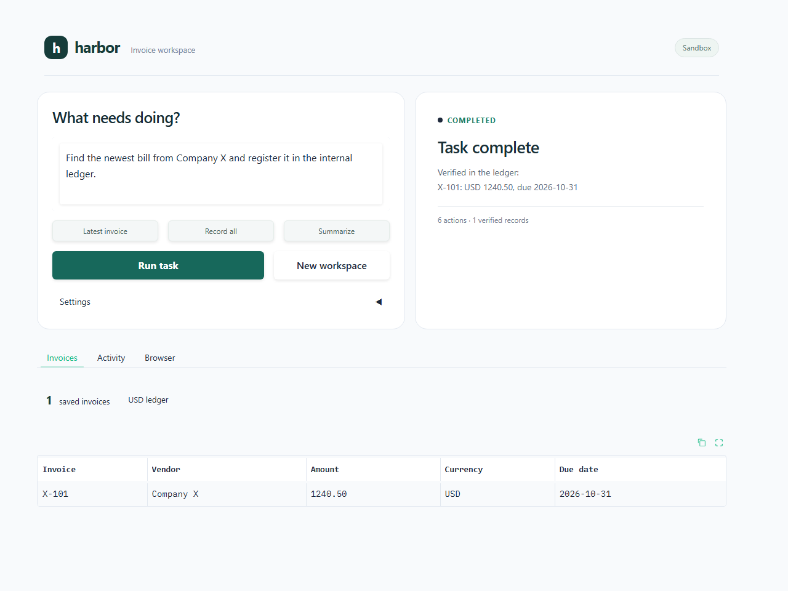
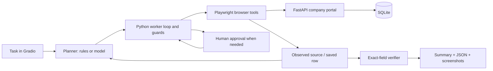

# Harbor - Autonomous Task Worker

**Give it an invoice goal. Watch it read, act, recover, and verify.**

Harbor is a small prototype for the Autonomous AI Task Worker problem. It operates a synthetic company portal using **real Chromium browser actions**, and saves records in **real SQLite**. It is deliberately narrow so the execution is understandable and testable.

> Two planners are available. **Offline demo is rule-based, not an AI model.** **Model planner uses an OpenAI-compatible API to interpret the goal and choose each next action.** They share the same executor, approval rules, memory and verifier. No company credentials are needed.



**Submission:** [demo video](docs/demo.mp4) · [evaluation evidence](docs/EVALUATION.md) · [real-model results](docs/model-evaluation.json)

## Start in five minutes

Use Python 3.11 or 3.12.

```bash
python -m venv .venv
```

Activate it:

```powershell
# Windows PowerShell
.venv\Scripts\Activate.ps1
```

```bash
# macOS / Linux
source .venv/bin/activate
```

Install and start:

```bash
pip install -r requirements.txt
python -m playwright install chromium
python app.py
```

Open **http://127.0.0.1:7860**. On Linux servers, use `python -m playwright install --with-deps chromium` if browser system libraries are missing.

Try the default task:

> Find the latest invoice from Company X, enter it into our internal system, and tell me once it is done.

Click **Run task**. Harbor reads the latest invoice, records X-101 for USD 1,240.50 due 2026-10-31, and verifies the saved fields. **Invoices** shows your ledger, **Activity** shows progress, and **Browser** shows the current browser view. Quick actions fill common requests; **New workspace** starts an empty, separate ledger.

## Turn on the AI planner

Copy `.env.example` to `.env`, then set:

```dotenv
OPENAI_API_KEY=your-key-here
OPENAI_MODEL=gpt-4.1-mini
OPENAI_BASE_URL=https://api.openai.com/v1
```

Restart the app. **AI worker** is selected automatically when a key is configured. Switch to **Offline rules** under **Settings** to run without API calls. `OPENAI_MODEL` and `OPENAI_BASE_URL` are configurable for a compatible provider supporting strict Chat Completions function calling. The default is an example model identifier; availability depends on your account/provider. Do not put keys in the UI or README. `.env` is ignored by Git.

The model receives the task and synthetic observations. It chooses a strictly structured action and invoice from the currently eligible choices; Python checks it again before doing anything. Read-only goals never offer a save action. Available unread documents are fetched through tools instead of requested from the user. A model cannot approve its own high-value write or assert completion without evidence.

Official reference: [OpenAI function calling](https://developers.openai.com/api/docs/guides/function-calling).

## Share a temporary live demo

```bash
python app.py --share
```

Gradio prints a public URL. The computer and process must stay running; this is a temporary tunnel, not permanent hosting. The company portal remains on localhost. Public model mode is disabled by default so visitors cannot spend your API budget. Offline browser execution still works on the shared demo.

If you intentionally want a public AI demo, set `ALLOW_PUBLIC_MODEL=true` in `.env` before starting with `--share`. Use only synthetic tasks. There is no production authentication, rate limiting or artifact retention policy. Sandbox separation is for demo isolation, not a security guarantee.

## Tasks to try

| Goal | What it demonstrates |
|---|---|
| Record the latest invoice from Company X. | Goal interpretation, latest-by-date selection, browser write, verification |
| Record all invoices from Company X. | Same engine handles multiple documents |
| Summarize all invoices from Acme Supplies. | Read-only goal; no ledger write |
| Record the latest invoice from Northstar Labs. | Pauses before USD 7,800; approve or decline the specific record |
| Record the latest invoice from Broken Fields Ltd. | Missing due date; clarification without guessing |
| Record the latest invoice. | Asks for a vendor |

Offline mode understands common English forms of **record/report + latest/all + one seeded vendor**. It rejects unsupported filters, payments, deletion and messages. Model mode accepts more phrasing, but the execution scope is still the same.

Each browser visitor has a separate sandbox. Repeated tasks reuse that sandbox's ledger, making duplicate prevention visible. Click **New workspace** to start fresh. Earlier run logs remain on disk. Run and workspace controls are locked during execution and while an approval is pending.

## Architecture



The worker does not receive the invoice contents directly from the seed array or write the database directly. It opens the inbox, follows the source link, fills the ledger form, clicks Save, and reads the ledger again. The portal itself owns database writes.

The loop is: **observe -> decide -> validate -> execute -> observe again**. Memory holds the chosen invoice IDs, extracted fields, save attempts, approval decisions and verified records. Both planners use this same memory.

### Code map

| File | Responsibility |
|---|---|
| `app.py` | Gradio UI and localhost portal startup |
| `worker/engine.py` | Worker loop, budgets, approvals, success gate and evidence |
| `worker/planner.py` | Offline grammar and optional model decisions |
| `worker/browser.py` | Browser selectors and real read/write tools |
| `worker/portal.py` | Synthetic inbox and ledger web pages |
| `worker/store.py` | SQLite persistence, uniqueness and injected failure scenarios |
| `tests/test_worker.py` | End-to-end browser reliability checks |

## Important decisions, in plain English

1. **Browser execution, not a pretend tool response.** The worker performs actual form actions in a controlled web app. This makes execution and verification observable.
2. **High-level tools, not unrestricted clicks.** The planner can discover, read, save and verify. Only the browser layer knows selectors. A different portal needs a new adapter; the loop remains reusable.
3. **Success is checked by code.** Saving a form or receiving a success message is insufficient. After navigation, the persisted invoice ID, vendor, amount, currency and due date must exactly match the observed source.
4. **Retry after reconciliation.** A lost acknowledgement can happen after a successful commit. Check the ledger before writing again. A database uniqueness constraint is a second defense against duplicates.
5. **Simple money handling.** Decimal validates amounts; original canonical strings are stored and compared. The sandbox uses USD only, so the USD 5,000 approval threshold is unambiguous.
6. **Bounded execution.** At most three save attempts per invoice and forty decisions per run. A 180-second loop budget is checked between actions; it is not a hard interrupt for an in-flight browser/model call. Errors return partial evidence.
7. **Human approval is explicit.** Above USD 5,000 the worker pauses before the write. Approval is bound to the selected invoice in the current run. Declining stops future writes; previous verified records remain.
8. **No framework needed.** A short Python loop is enough for this scope. No vector database, distributed queue, multi-agent orchestration or hidden reasoning log.

## Reliability and verification

Failure injection is kept in the integration tests and model evaluation script, outside the everyday app interface:

- **Save fails once:** transient error, followed by ledger check and successful retry.
- **Save succeeds, acknowledgement lost:** row is committed, UI reports an error, worker finds the row and avoids a duplicate.
- **Save always fails:** stops after three attempts and reports failure.
- **Saved amount is corrupted:** exact-field verification fails; the conflicting row remains for manual review. The worker never calls it successful.

All successful write summaries are generated by the host from observed verified rows. Read-only summaries are generated from source documents and are labeled that way. Screenshots and a timestamped JSON trace are saved under `artifacts/runs/<run-id>/` for local review.

## Tests

```bash
python -m pytest -q
```

The integration tests launch an HTTP portal, Chromium and a temporary SQLite database. They cover recovery, lost acknowledgements, duplicates, all/latest scope, read-only behavior, approval/resume/decline, missing fields, corrupt saves, permanent failure, isolation, ambiguity, and a planner trying to finish without evidence. Live model behavior must also be tested with a real API key; the offline tests do not establish model quality.

To repeat the real API evaluation (uses your API budget):

```bash
python scripts/evaluate_model.py
```

This checks ten goal/failure combinations using the real configured model, browser, HTTP portal and database. The submitted run uses **OpenAI `gpt-4.1-mini`**. Results and the initial debugging run are included in `docs/`; see the evaluation report for measured outcomes and their limits.

If Windows blocks the default temporary directory, use `python -m pytest -q --basetemp=work/pytest-local` (choose a disposable folder).

## Demo video

See [demo walkthrough](docs/DEMO.md) and [the captioned video](docs/demo.mp4). The recording shows the actual Gradio web app with **AI worker** selected. It covers browser execution, verified records, read-only summaries, multiple invoices, human approval and missing information. Controlled failure recovery is covered separately by the integration tests and model evaluation report. To record again:

```bash
pip install imageio-ffmpeg
python scripts/record_demo.py --mode offline
# With the app already running and a configured API key:
python scripts/record_demo.py --mode model
```

The recording script checks visible UI states and captures a Playwright screencast, then converts it to MP4 with short workflow captions. It does not fabricate execution results. `demo-chapters.json` and `demo-captions.srt` identify the recorded sections. The video is silent; captions provide the explanation. A model recording can take longer and may reveal model limitations rather than reaching the expected outcome.

## Assumptions and limitations

- Only a seeded synthetic invoice portal is supported. Source invoices are HTML documents, not real email attachments or OCR PDFs.
- Fixed sample dates in October 2026; latest means maximum issue date, not machine clock time. Tied latest dates require clarification.
- Offline mode is a deterministic baseline. An AI-worker submission should also demonstrate the model planner with a real model.
- One vendor per task; latest/all scope; USD currency. No payments, deletion, outgoing messages, arbitrary URLs or unrestricted desktop access.
- Clarification ends the current run; enter a revised task. Approval resumes the same run.
- A batch can partially complete before a later failure. No rollback or automatic repair of conflicting rows.
- Run memory is in the current Gradio session, with JSON checkpoints for review. Automatic resume after a process restart is not implemented. The SQLite ledger persists.
- LLM semantic interpretation can be wrong. Typed actions and host guards constrain side effects but do not solve prompt injection or guarantee correct intent interpretation.
- Public demos are temporary and unauthenticated. Data separation uses random session IDs, not enterprise authorization. Runs/artifacts need manual cleanup.
- API calls have timeouts and limited transient retries; local model availability, provider compatibility and billing depend on your setup.

## What I would build next

Expand the evaluation set with unseen task wording and measure success rate, false completion, latency and API cost over repeated runs. Then add a second sandbox adapter, restart-safe checkpoints and cancellation. After that, add stronger access control, audited approval tokens, artifact retention, and PDF invoice parsing. Keep the planner/executor boundary simple while extending the workflow.

## Components and external services

- **Python:** application and worker loop.
- **Gradio:** UI, session state, streaming updates, optional public tunnel.
- **FastAPI + Uvicorn:** localhost simulated company app.
- **Playwright + Chromium:** actual browser execution and screencast.
- **SQLite:** persisted ledger (standard library).
- **Pydantic:** structured intent/action validation.
- **HTTPX:** optional model API calls.
- **python-dotenv:** local server configuration.
- **pytest:** real browser integration tests.
- **Optional OpenAI-compatible provider:** model-based intent interpretation and next-action decisions. No paid service is required for offline mode.
- **ReportLab:** personal project explanation PDF; **FFmpeg / imageio-ffmpeg:** demo conversion. These are deliverable tools, not worker runtime dependencies.

AI coding assistance was used to build this prototype. The submitted design is intentionally small enough to inspect, explain, debug and change during a technical discussion.
